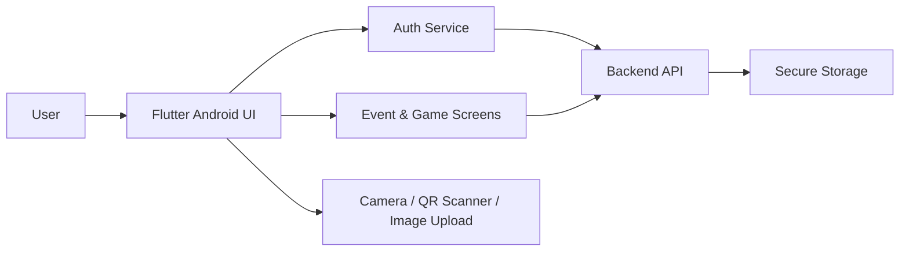

<p align="center">
  
</p>

<p align="center">
  A mobile-first Android app for creating and joining social bingo-style events with a fun, interactive experience.
</p>

<p align="center">
  <a href="https://flutter.dev/">
    
  </a>
  <a href="https://developer.android.com/">
    
  </a>
  <a href="https://dart.dev/">
    
  </a>
  <a href="https://amingoapi.amfoss.in/">
    
  </a>
  <a href="CONTRIBUTING.md">
    
  </a>
</p>

## Overview

amMingo is an open-source alternative to Human Bingo designed to bring people together through interactive event-based gameplay. The app provides a polished mobile experience for users to sign in, create or join events, participate in bingo-style activities, and engage with others in a social setting.

## Key Features

- Email-based OTP login flow
- Google sign-in support
- Event creation with description, location, duration, and participant limits
- Event joining through a 6-digit code or QR scan
- Bingo-style gameplay interaction
- Tile submission with friend details, facts, and images
- Leaderboard and game-state visibility
- Light and dark theme support
- Responsive Android UI built with Flutter Material components

## Tech Stack

- Flutter & Dart
- Provider for state management
- Dio for HTTP networking
- Flutter Secure Storage for persistent auth data
- Mobile Scanner for QR code scanning
- Camera and Image Picker for media capture
- Google Fonts and Material Design styling

## Architecture

The application follows a simple and scalable client-service structure:



## Getting Started

### Prerequisites

Make sure the following are installed on your machine:

- Flutter SDK 3.11 or newer
- Android Studio
- An Android emulator or a physical Android device

### Installation

```bash
git clone <repository-url>
cd ammingo-frontend
flutter pub get
```

### Run on Android

```bash
flutter run -d android
```

If you want to run it on a specific connected device or emulator:

```bash
flutter devices
flutter run -d <device-id>
```

## Configuration

The frontend communicates with the backend API through the service layer in [lib/services/auth_service.dart](lib/services/auth_service.dart).

Default API base URL used by the app:

```text
https://amingoapi.amfoss.in/api
```

## Project Notes

- The app is currently focused on Android mobile usage.
- Authentication and game operations are handled via backend API requests.
- The UI is organized around dedicated screens for login, profile, event creation, event joining, gameplay, and leaderboards.
- The project is well-suited for further enhancements such as richer game modes, analytics, and offline support.

## Contributing

Contributions are welcome and encouraged.

If you would like to improve the app, fix a bug, or add a new feature, please follow the guidelines in [CONTRIBUTING.md](CONTRIBUTING.md).

The typical contribution flow is:

1. Fork the repository
2. Create a new branch for your feature or fix
3. Make your changes and test them locally
4. Open a pull request with a clear description of your work

## Our Contributors

[](https://github.com/amfoss/ammingo-frontend/graphs/contributors)

## License

This project is licensed under the [GNU General Public License (GPL)](LICENSE).

Please review the license file in this repository for details on usage, modification, and distribution.